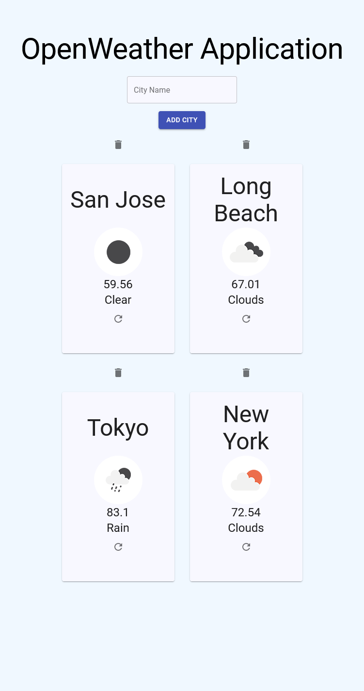

# Weather App with OpenWeather

By Justin Mabutas



## Description

This is a side-project to demonstrate my skills in Javascript, React, using REST APIs, and designing with Material UI.

## Installation

Clone the git repository to your machine.

Use node package manager [npm](https://www.npmjs.com/) to install dependencies.

```bash
npm install
```

Create a .env file at the root directory of the project with your OpenWeather API key.

```bash
REACT_APP_OPENWEATHER_API_KEY={insert your api key here}
```

Now run.

```bash
npm start
```
